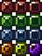

# FingerDefense 指尖防御

## 玩法介绍 
一款打砖块游戏，玩家触摸屏幕生成球拍，通过接到小球，撞击上方的方块，获得分数，打完所有砖块则通过关卡。

## 项目介绍 
使用Unity+[PeakScript](https://github.com/Jenocn/PeakScript)开发。
实现了一个游戏的基本流程。

## 砖块功能 

- 红色砖块：撞击1次破坏
- 绿色砖块：撞击2次破坏
- 蓝色砖块：撞击3次破坏
- 橙色砖块：破坏后产生范围爆炸
- 黄色砖块：破坏后小球额外生成一个

## 游戏截图 

